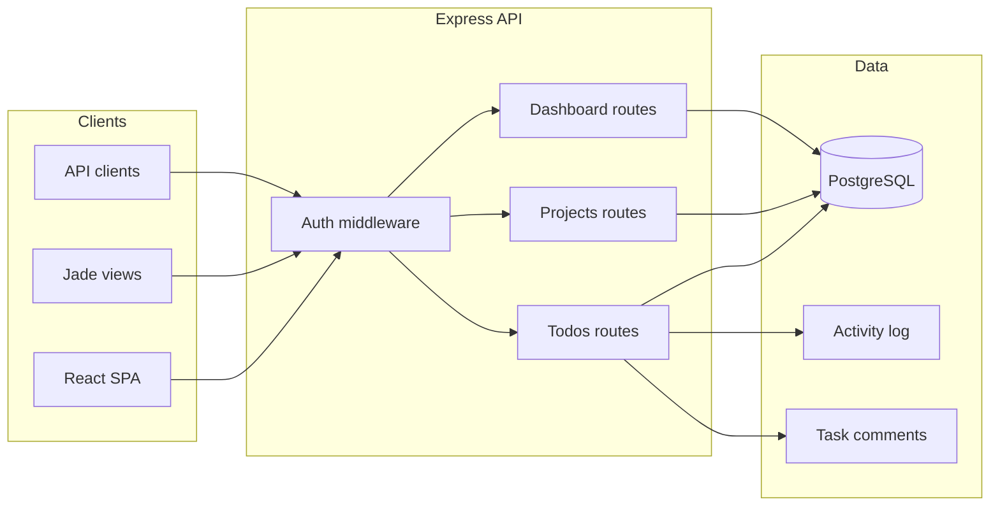

# TaskFlow — Full-Stack Project Management

A production-style task and project management application with teams, assignment, kanban boards, activity feeds, and a REST API. Built as a portfolio project demonstrating full-stack engineering: Node/Express backend, PostgreSQL/Prisma, React SPA, CI-tested API, and Render deployment.

## Highlights

- **Projects & inbox** — organize work into color-coded projects with per-project stats
- **Team collaboration** — invite members, assign tasks within project teams
- **Kanban & list views** — status workflow (`todo` → `in_progress` → `done`), drag-friendly ordering
- **Activity feed** — audit trail for creates, assignments, status changes, and comments
- **Task comments** — threaded discussion on individual tasks
- **Dual clients** — React SPA (`Frontend/`) and server-rendered Jade views
- **API-first auth** — session cookies for HTML, Bearer tokens for Postman/React
- **CI pipeline** — GitHub Actions runs migrations + API tests + frontend build

## Tech stack

| Layer | Technology |
|-------|------------|
| API | Node.js 22, Express 5 |
| Database | PostgreSQL, Prisma ORM |
| Frontend | React, TypeScript, Vite, TanStack Query |
| Auth | express-session + JWT Bearer tokens |
| Deploy | Render (web service + managed Postgres) |

## Architecture



## Getting started

### Prerequisites

- Node.js 22+
- PostgreSQL (local or Render External Database URL)

### Backend

```bash
cp .env.example .env
# Edit DATABASE_URL, SESSION_SECRET, JWT_SECRET

npm install
npm run migrate:deploy
npm run dev
```

API runs at `http://localhost:3000`.

> **Render note:** If `DATABASE_URL` uses an internal host (`dpg-xxxxx`), local migrations will fail. Copy the **External** connection string from Render → Postgres → Connections.

### Frontend

```bash
cd Frontend
npm install
npm run dev
```

SPA runs at `http://localhost:5173` and talks to the API with Bearer auth.

### Tests

```bash
npm test
```

Requires a running Postgres instance matching `DATABASE_URL`.

## API overview

Send `Accept: application/json` or `Authorization: Bearer <token>` for JSON responses.

| Method | Endpoint | Description |
|--------|----------|-------------|
| POST | `/signup` | Create account → `{ token, user }` |
| POST | `/login` | Log in → `{ token, user }` |
| GET | `/todos` | List tasks (`?projectId=`, `?scope=assigned`) |
| POST | `/todos` | Create task |
| PATCH | `/todos/edit/:id` | Update task |
| PATCH | `/todos/:id/status` | Update kanban status |
| GET/POST | `/todos/:id/comments` | Task comments |
| GET | `/projects` | List projects |
| POST | `/projects/:id/members` | Add team member |
| GET | `/dashboard` | Stats, projects, recent activity |

## Project structure

```
├── app.js                 # Express entry
├── routes/                # HTTP handlers
├── shared/                # Prisma, auth, project/activity services
├── prisma/                # Schema & migrations
├── Frontend/              # React SPA
├── views/                 # Jade templates
└── tests/                 # API integration tests
```

## Deployment

Push to GitHub and connect to Render. `npm start` runs migrations then the server. Set `SESSION_SECRET`, `JWT_SECRET`, and `CORS_ORIGIN` in Render environment variables.

## License

MIT — built for learning and portfolio demonstration.
